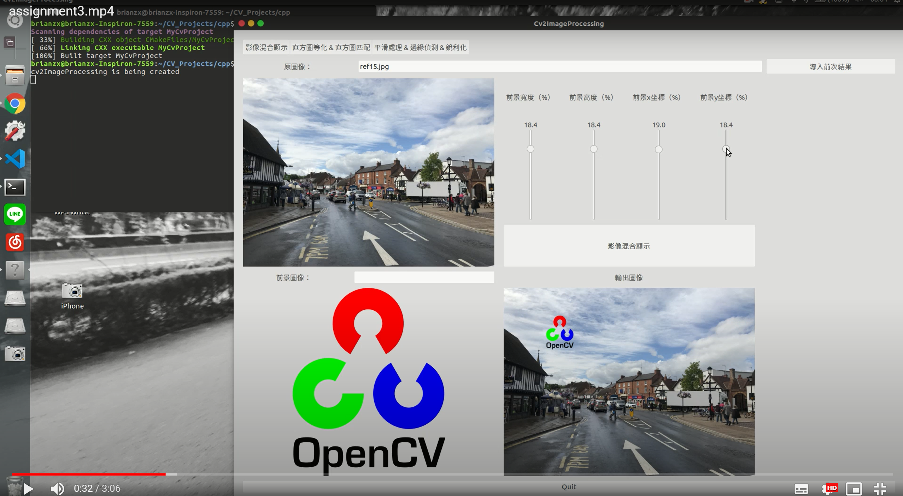

# opencv2_proj

for digital image procesing

[](https://drive.google.com/file/d/1Tjnl0ZwCD9qAeLRhjfe5TNw1Q316G0YN/view?usp=sharing)

```
=========================
 use following commands:
=========================

cd cpp

cmake .

make

./MyCvProject


=============================
	directory tree
=============================
.
├── cpp
│   ├── CMakeFiles
│   │   ├── 3.5.1
│   │   │   ├── CompilerIdC
│   │   │   └── CompilerIdCXX
│   │   ├── CMakeTmp
│   │   └── MyCvProject.dir
│   │       └── src
│   ├── img			// all image files
│   │   ├── cdf			// cdf images
│   │   ├── diff		// processing differences
│   │   ├── output		// processing output images
│   │   ├── pdf			// pdf images
│   │   └── src			// source images
│   └── src			// cv2imageprocessing(.cpp/.h)
└── qt
    ├── build-cv2proj-Desktop_Qt_5_8_0_GCC_64bit-Debug
    └── cv2proj

18 directories
```
